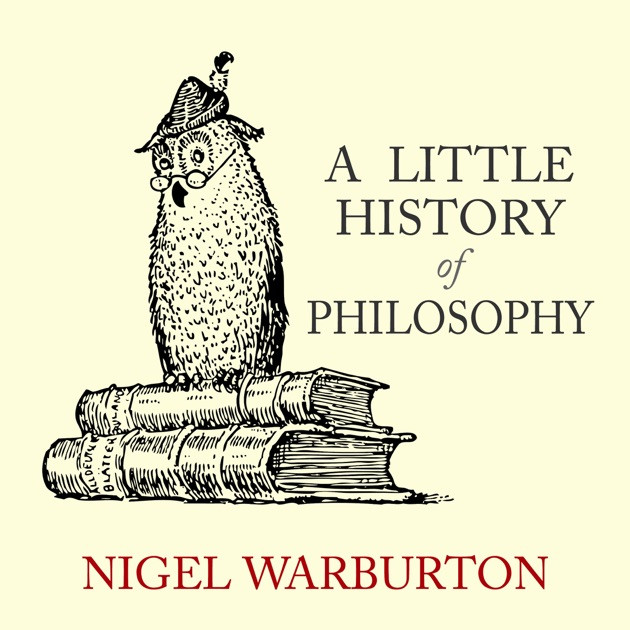

# Summary

This book is, as it states, a short history that covers various philosophers and the most notable or popular questions they asked that have shaped what philosophy is today. It reads chronologically through history beginning with Socrates and Plato, and ends with the likes of Alan Turing and Peter Singer. The thought provoking questions asked by philosophers, both men and women, throughout history made this a great book to get a quick rundown of these thinkers their ideas. Some of what is asked in this book has been refuted or revised since the questions were first posed, but still others are questions we ask ourselves today. 

# Impressions

This book doesn't dive into any deep discussions about the philosophies covers, hence the name "A Little History...". However, it does provide a primer into these ideas that have shaped philosophy over the millennia. It provides you with the Philosopher's name, the question, thought, or idea, and counter-arguments for and against the ideas presented. You are left with "both sides of the story", and are left to think and look further into the questions asked. 

Many of the books I read are really audiobooks, and I don't often have the chance to highlight or make notes in the margin. It's a blessing and a curse in this way because I can listen to more books while commuting, but I can't easily circle back to an idea I heard. All that to say this would be a book I may read again so I can circle back on those chapters I was most curious about. Hopefully I will save you some trouble, and if you are interested in learning more about philosophy you will just pick up a hard copy and make the notes the first time around.

As stated in the summary, the book progresses chronologically, and in what I thought was a pleasent flow. There isn't an abrupt break between each chapter and philosophy. Rather the end of one philosophy is set up so that the next idea is presented as a continuation or counter of the last chapter. This progression lends to it's chronological layout by giving it a feel of moving through time as the questions posed are built upon or by refuted by their successors.

The philosophers and their ideas that stood out to me the most are those of the Stoics (Epictetus, Cicero, and Seneca), Friedrich Nietzche, Immanuel Kant (who gets two chapters in this book), and Hannah Arendt on the "banality of evil". These and likely more I'd like to touch back up on, but they were what stood out to me the most on my first read-through, or rather, listen-through.

Philosophy is about asking questions regarding existence, the nature of ourselves and the universe, and reasoning out why we believe the things we believe. I wish learning has always been this important to me, but I am trying to catch up. It's this understanding that gives me a greater appreciation for the world we live in and the planet we live on.